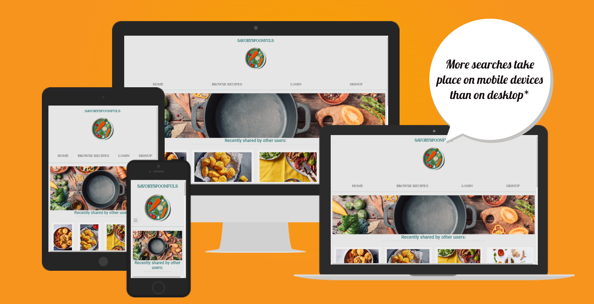
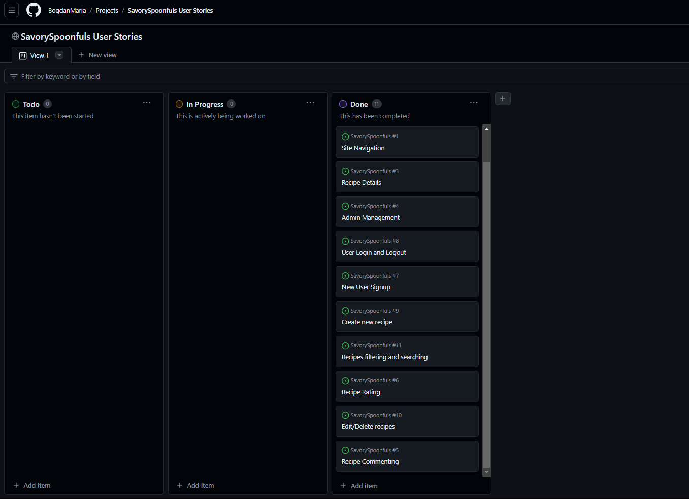
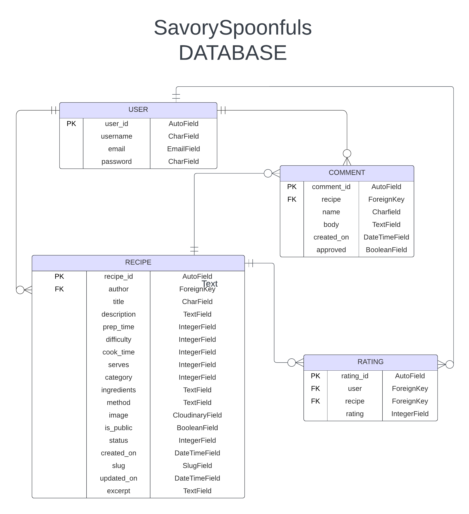
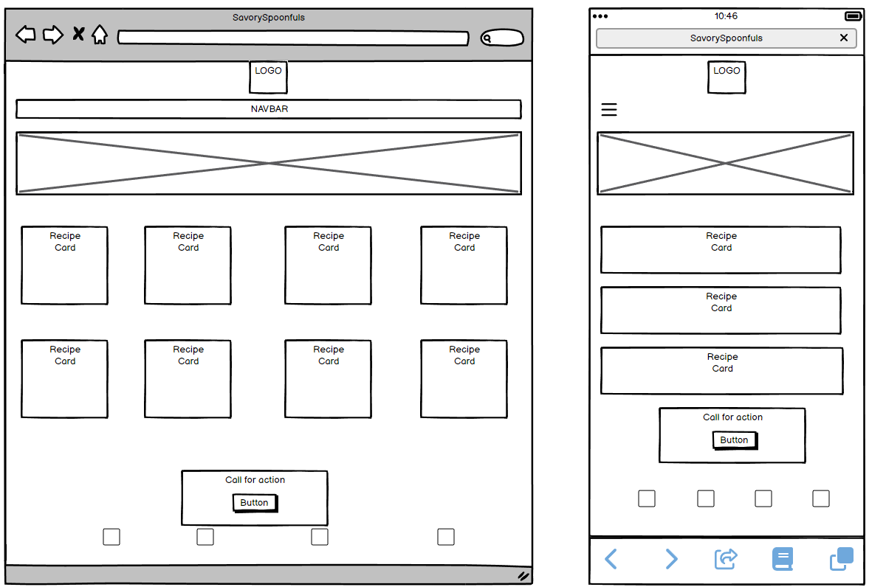
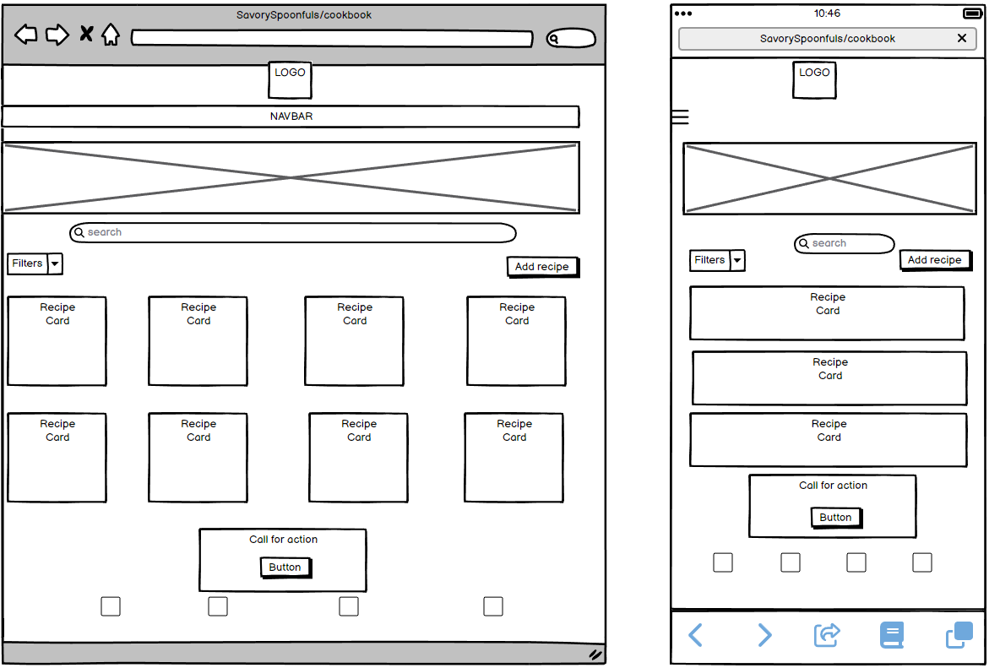
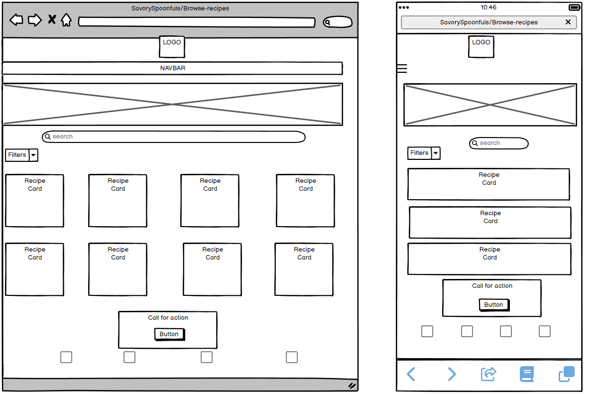
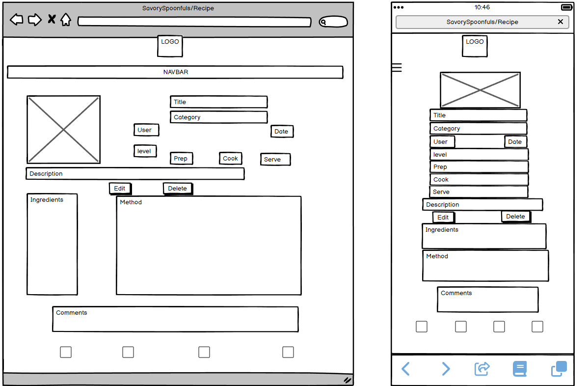
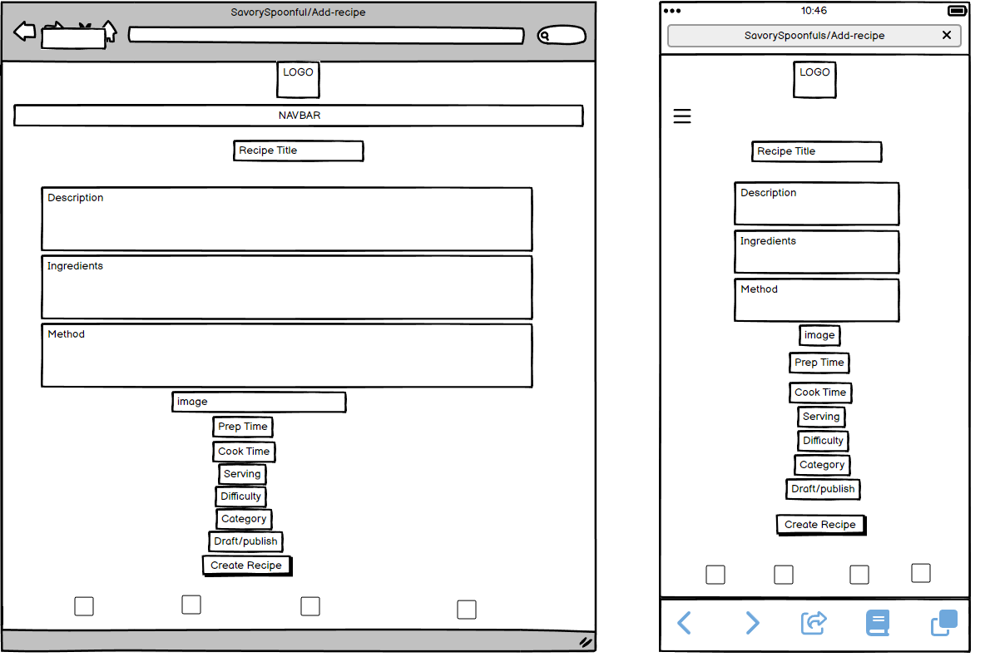
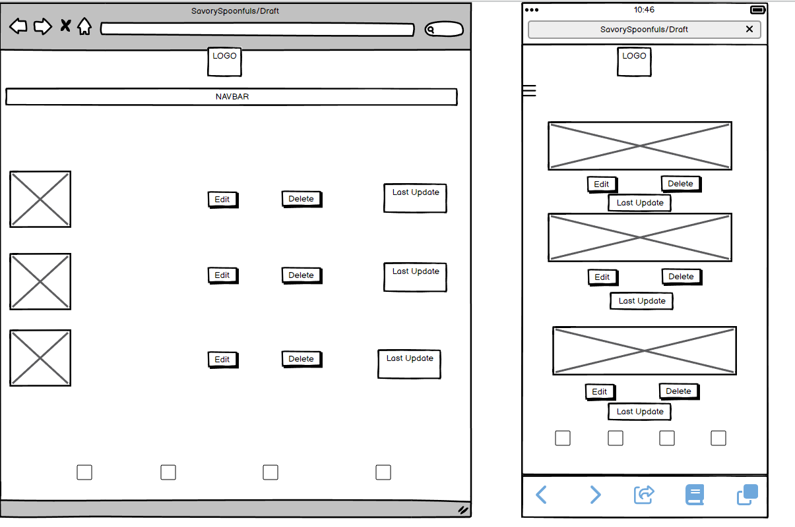

# SAVORYSPOONFULS (Milestone Project 4)

[View the live website here](https://savouryspoonfuls-d64d32e6ab0b.herokuapp.com/)

1. [INTRODUCTION](#1-introduction)
2. [USER EXPERIENCE DESIGN](#2-user-experience-design)
   - [User stories](#user-stories)
   - [Project Management](#project-management)
   - [Database Schema](#database-schema---er-diagram)
   - [Wireframes](#wireframes)
   - [Design](#design)
     - [Logo](#logo)
     - [Colors](#colors)
     - [Icons](#icons)
     - [Typography](#typography)
     - [Images](#images)
     - [Mockups](#mockups)
3. [FEATURES](#3-features)
   - [Existing features](#existing-features)
   - [Features to implement in the future](#features-to-implement-in-the-future)
4. [TESTING](#4-testing)
5. [TECHNOLOGIES USED](#5-technologies-used)
   - [Main languages used](#main-languages-used)
   - [Frameworks, Libraries and Programs used](#frameworks-libraries-and-programs-used)
6. [CREDITS](#6-credits)
7. [DEPLOYMENT](#7-deployment)
8. [ACKNOWLEDGEMENTS](#8-acknowledgements)

## 1. INTRODUCTION

SavorySpoonfuls is a Django app created to provide users with a digital cookbook, accessible through an account registration, __to save their recipes, share them with the Community if wanted, and access other users' public recipes to get inspired__.

The app allows users to filter the recipes by category or title/ingredient, rate and comment on other users' recipes. 

CRUD functionality is fully implemented: recipes can be created, read, edited or deleted from the database.

This app has been created to showcase my Full Stack knowledge, along with my skills relating to responsiveness, accessibility and UX Design.
- - - 
## 2. USER EXPERIENCE DESIGN

### USER STORIES

#### EPIC: ADMINISTRATION

- As a **Site Administrator**, I can **perform CRUD on the recipes and their comments** so that **I can manage the app content and keep it consistent and appropriate at all times**.

#### EPIC: USER PROFILE

- As a **Site User**, I can **create an account** so that **I can add, edit and delete recipes in my cookbook, choose which ones to share with the Community and interact with other users' recipes**.

- As a **Site User**, I can **log in and log out from my account** so that **it stays secure**.

#### EPIC: APP NAVIGATION

- As a **Site User**, I can **immediately understand the website's purpose** so that **I can decide if it meets my needs**.

- As a **Site User**, I can **easily and intuitively navigate the site** so that **I can find the desired content**.

- As a **Site User**, I can **view a paginated list of recipes** so that **I can choose and select the ones I am interested in**.

- As a **Site User**, I can **click on a recipe** so that **I can view the full details and comments**.

#### EPIC: COOKBOOK MANAGEMENT

- As a **Site User**, I can **create a new recipe** so that **it can be added to my Cookbook and, if wanted, shared with other users**.

- As a **Site User**, I can **edit and delete my recipes** so that **I can improve my Cookbook or remove the recipes that I no longer like and want to have in my arsenal**.

#### EPIC: RECIPE INTERACTION

- As a **Site User**, I can **rate other users' recipes** so that **I can leave feedback about them**.

- As a **Site User**, I can **comment on the recipes other users have made public** so that **I can express my feedback about them**.

#### EPIC: UX IMPROVEMENTS

- As a **Site User**, I can **search through the recipes by category or name** so that **I can quickly locate the recipe I'm looking for**.

### PROJECT MANAGEMENT
Agile practices have been followed throughout the development of SavorySpoonfuls and the GitHub __Project Board__ has been particularly useful to do so. 
Each User Stories was created as an Issue on the Github repository for this project, then added to the "To do" section of the Project Board, moved to the "In progress" while working on it, and ultimately moved to the "Done" section once the feature was fully implemented.

[Visit the project board here](https://github.com/users/BogdanMaria/projects/4/views/1)

### DATABASE SCHEMA - ER DIAGRAM

The database models and fields were planned and outlined using an ER Diagram in [Lucidchart](https://lucid.co/).

The creation of the diagram was vital to understand how the models relate to each other:

- __User__: Django allAuth was used for dealing with the registration, management and authentication of the user model.
A specific user can be the creator of zero or many recipes, comments and ratings but one specific recipe, comment or rating can belong to one (and one only) user.

- __Recipe__: a recipe can have zero or many comments, and zero or many ratings.

- __Comment__: a specific comment can belong to one (and one only) recipe.

- __Rating__: a certain rating is related to one (and one only) recipe.
- - - 

### WIREFRAMES

#### Home Wireframe

- - - 

#### CookBook Wireframe

- - -

#### Browse Recipe Wireframe

- - -

#### Recipe Wireframe

- - -

#### Add Recipe Wireframe

- - -

#### Draft Wireframe

### DESIGN

- #### LOGO

SavorySpoonfuls logo was created by me using [Canva](https://www.canva.com/).
I wanted to create an engaging logo that immediately conveys the app's purpose, with simple colors and a "fun" feel.
If clicked, it redirects to the homepage of the website.

- - - 